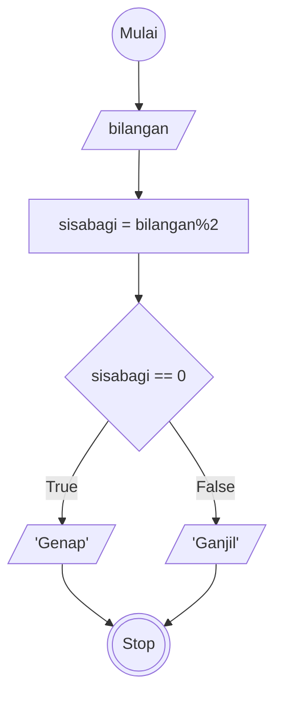

# Algoritma

## Algoritma Bilangan Ganjil dan Genap

## Deskriptif

Membuat Algoritma menentukan bilangan ganjil atau genap

1. Mulai
2. input/masukan bilangan
3. hitung sisa bagi dari bilangan mod 2
4. jika hasil sisa bagi nya sama dengan 0 maka Bilangan Genap
5. jika hasil sisa baginya sama dengan 1 maka Bilangan Ganjil
6. selesai

## Flowchart
Membuat Algoritma menentukan bilangan ganjil atau genap


## PSEUDO-CODE
Membuat Algoritma menentukan bilangan ganjil atau genap
```pseudo

    DECLARE a: INTEJER
    
    INPUT a

    IF a%2 == 0 THEN
        OUTPUT "Bilangan Genap"
    ELSE 
        OUTPUT "Bilangan Ganjil"
    ENDIF


```
