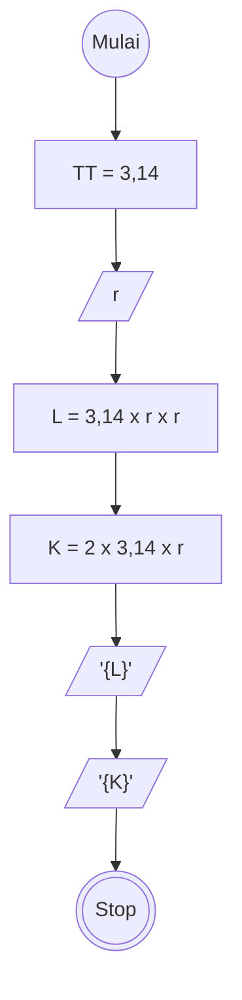

# Algoritma

## Algotrima Luas dan Keliling Lingkaran

## Deskriptif

Membuat Algoritma menghitung luas dan keliling lingkaran

1. Mulai
2. definisikan konstanta phi dengan 3,14
3. masukan nilai jari jari lingkaran
4. definisikan rumus luas lingkaran yaitu Luas dengan 3,14 dikali jari-jari pangkat dua
5. definisikan rumus keliling lingkaran dengan 2 dikali 3,14 dikali nilai jari-jari
6. Tampilkan hasil luas dan keliling lingkaran
7. selesai

## Flowchart

Membuat Algoritma menghitung luas dan keliling lingkaran

