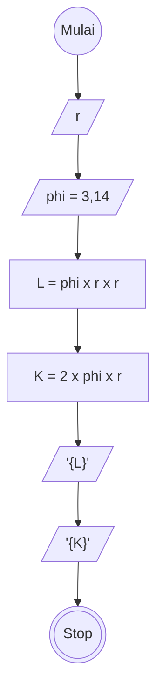

# Algoritma

## Algoritma Luas dan Keliling Lingkaran

## Deskriptif

Membuat Algoritma menghitung luas dan keliling lingkaran

1. Mulai
2. masukan nilai jari jari lingkaran
3. definisikan konstanta phi dengan 3,14
4. definisikan rumus luas lingkaran dengan 3,14 dikali nilai jari-jari pangkat dua
5. definisikan rumus keliling lingkaran dengan 2 dikali 3,14 dikali nilai jari-jari
6. Tampilkan hasil luas dan keliling lingkaran
7. selesai

## Flowchart

Membuat Algoritma menghitung luas dan keliling lingkaran



## PSEUDO-CODE

Membuat Algoritma menghitung luas dan keliling lingkaran

```pseudo
    DECLARE r: INTEGER
    DECLARE L: DOUBLE
    DECLARE K: DOUBLE
    CONSTANT phi = 3,14

    INPUT r
    L <-- phi * r * r
    OUTPUT L
    K <-- 2 * phi * r
    OUTPUT K

```
