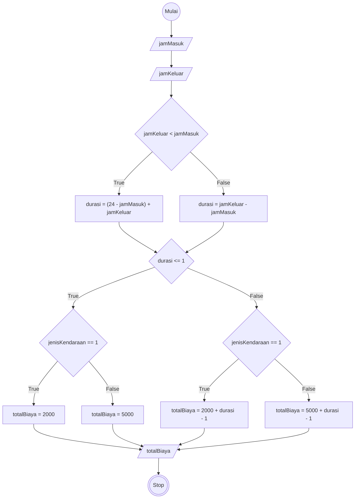

Program yang akan kalian dibuat di mulai algoritma deskriptif, flowchart, dan pseudocode

# Algoritma Menghitung total biaya parkir

## Deskriptif

Memecahkan masalah menghitung total biaya parkir

1. Mulai
2. input jamMasuk dan jamKeluar
3. input jenis kendaraan 1 dengan motor dan 2 dengan mobil
4. hitung durasi dengan jika jamKeluar kurang dari jamMasuk maka asumsikan durasi ditambah 24
5. jika durasi kurang dari sama dengan 1 jam maka biaya untuk motor 2000, dan untuk mobil 5000
6. jika durasi lebih dari 1 jam
7. jika motor maka totalBiaya dengan 2000 ditambahkan dengan hasil dari durasi dikurang 1 dikali 1000
8. jika mobil maka totalBiaya dengan 5000 ditambahkan dengan hasil dari durasi dikurang 1 dikali 3000
9. Tampilkan totalBiaya parkir
10. selesai

## Flowchart

Memecahkan masalah menghitung total biaya parkir



## PSEUDO-CODE

```pseudo

    DECLARE jamMasuk, jamKeluar, durasi : INTEGER
    DECLARE totalBiaya : REAL
    
```
