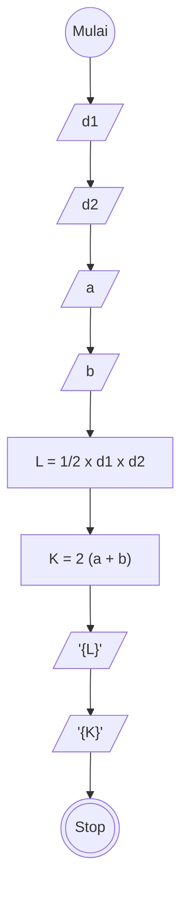

Program yang akan kalian dibuat di mulai algoritma deskriptif, flowchart, dan pseudocode

# Algoritma Menghitung Luas dan Keliling Layang layang

## Deskriptif

Menghitung Luas dan Keliling Layang layang

1. Mulai
2. input/ masukan nilai diagonal satu
3. input/ masukan nilai diagonal dua
4. input/ masukan nilai a
5. input/ masukan nilai b
6. definisikan rumus luas Layang layang dengan 1/2 dikali diagonal satu dikali diagonal dua
7. definisikan rumus layang layang dengan 2 dikali (a ditambah b)
8. Tampilkan hasil luas dan keliling Layang layang
9. selesai

## Flowchart

Menghitung Luas dan Keliling Layang layang



## PSEUDO-CODE

Menghitung Luas dan Keliling Layang layang

```pseudo
    DECLARE d1, d2, a, b : INTEGER

    INPUT d1, d2, a, b

    L <-- 1/2 * d1 * d2
        OUTPUT L
    K <-- 2 (a + b)
        OUTPUT K


```
