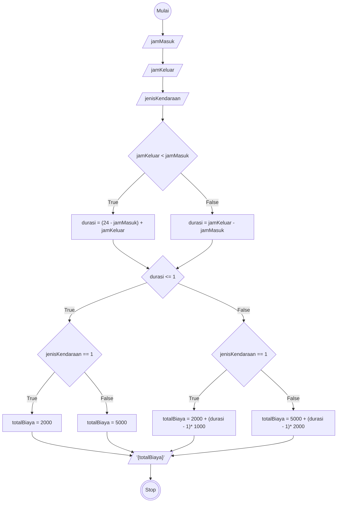

# Algoritma Menghitung total biaya parkir

## Deskriptif

Memecahkan masalah menghitung total biaya parkir

1. Mulai
2. input jamMasuk dan jamKeluar
3. input jenis kendaraan dengan nilai 1 untuk motor dan 2 untuk mobil
4. hitung durasi dengan jika jamKeluar kurang dari jamMasuk maka 24 dikurangi jamMasuk ditambah jamKeluar
5. jika durasi kurang dari sama dengan 1 jam maka biaya untuk motor 2000, dan untuk mobil 5000
6. jika durasi lebih dari 1 jam untuk motor maka totalBiaya dengan 2000 ditambahkan dengan hasil dari durasi dikurang 1 dikali 1000
7. jika untuk mobil maka totalBiaya dengan 5000 ditambahkan dengan hasil dari durasi dikurang 1 dikali 3000
8. Tampilkan totalBiaya parkir
9. selesai

## Flowchart

Memecahkan masalah menghitung total biaya parkir



## PSEUDO-CODE

```pseudo

    DECLARE jamMasuk, jamKeluar, durasi, pilihan : INTEGER
    DECLARE totalBiaya : REAL
    DECLARE jenisKendaraan : INTEGER

    INPUT jamMasuk, jamKeluar
    INPUT jenisKendaraan

    IF jamKeluar < jamMasuk THEN
        durasi <-- (24 - jamMasuk) + jamKeluar
    ELSE
        durasi <-- jamKeluar - jamMasuk
    ENDIF

    IF durasi <= 1 THEN
        IF jenisKendaraan == 1 THEN
            totalBiaya <-- 2000
        ELSE
            totalBiaya <-- 5000
        ENDIF
    ELSE
        IF jenisKendaraan == 1 THEN
            totalBiaya <-- 2000 + (durasi - 1) * 1000
        ELSE
            totalBiaya <-- 5000 + (durasi - 1) * 2000
        ENDIF
    ENDIF

    OUTPUT "Total Biaya Parkir = ", totalBiaya

```
